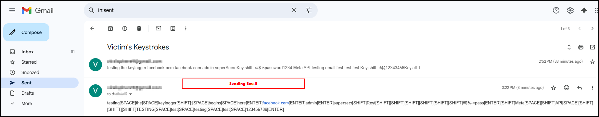
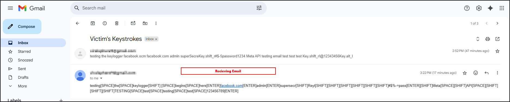

<h1 align="center">🖥️ Python Keylogger Portfolio</h1>

<h2>🔑 Keylogger v1: Basic Python Script</h2>

This Python script is a <strong>basic keylogger</strong> that uses the <code>pynput</code> library to record keystrokes and write them to a file named <code>log.txt</code>. Here's a quick breakdown:

<ul>
  <li>It uses <code>pynput.keyboard.Listener</code> to listen for key presses.</li>
  <li>Each key press is processed by <code>log_keystroke()</code>, which:
    <ul>
      <li>Logs printable characters directly.</li>
      <li>Converts special keys (like Enter, Ctrl, etc.) into readable tags (e.g., <code>[ENTER]</code>, <code>[SHIFT]</code>).</li>
    </ul>
  </li>
  <li>It writes the keystrokes to <code>log.txt</code>, ensuring each line has a max of ~45 characters for readability.</li>
  <li>The keylogger starts running when the script is executed.</li>
</ul>

<h2>📧 Keylogger v2.0: Email-Based</h2>

<ul>
  <li><strong>Python keylogger v2.0 (Logged keystrokes sent via Email)</strong></li>
  <li>Built with <strong>Python 3.11.2</strong></li>
</ul>

<ol>
  <li>
      <strong>Setup:</strong> Set up an email to receive the keystroke data and another email to send the data. 
  </li>
  <li>
    Generated an <strong>app password</strong> through a Google account to allow secure SMTP access. 
    
  </li>
  <li>
    Compiled the script using <strong>PyInstaller</strong> into an executable and disguised it with a <strong>gear icon</strong>, mimicking a legitimate system service or application. 
        
  </li>
  <li>
    Tested functionality by typing in Notepad and verified that it logged and emailed after every 300 characters. The email arrives with the subject line: <em>"Victim's Keystrokes"</em>. 
              
  </li>
  <li>
    <strong>Persistence Options:</strong> An attacker could add the executable to <strong>system startup</strong>. The victim would be unaware, as the process appears like a normal system service in Task Manager. Additionally, it can be deployed via a <strong>USB stick</strong> by tampering with <strong>AutoPlay settings</strong> or using an <code>autorun.inf</code> file to launch it automatically when plugged in. <em>(Note: This functionality is not yet implemented in the current version.)</em> 
    
  </li>
  <li>
    It is <strong>fast and efficient</strong>, missing only 2 characters during testing — likely while sending an email. This can be improved by increasing the character limit (from 300) before each send cycle. 
  </li>
  <li>
    <strong>Update:</strong> A <strong>Windows message pop-up</strong> was added to falsely notify the victim of what the program is doing, discouraging them from ending the process in Task Manager. 
    
  </li>
</ol>

<blockquote>
⚠️ <strong>Disclaimer:</strong> This code is intended strictly for educational and ethical testing purposes. Unauthorized use of keyloggers is illegal and unethical. Use responsibly.
</blockquote>
